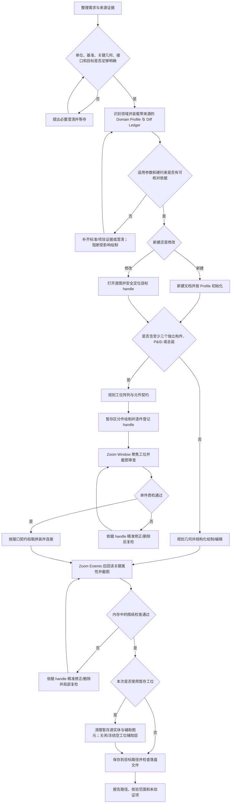

# 本地 CAD MCP 工作流

## 可用工具与真实边界

执行前检查当前会话工具清单，确认本地 CAD MCP 已启用。当前常见工具名以运行时提供的 schema 为准；直接按实际名称和参数调用，不猜参数、不编写包装器、不改走 shell CLI。

常见工具按用途分组：

- 文档：`new_drawing`、`open_drawing`、`save_drawing`、`close_drawing`
- 绘图：`draw_line`、`draw_polyline`、`draw_rectangle`、`draw_circle`、`draw_arc`、`draw_ellipse`、`draw_text`、`draw_hatch`、`add_dimension`
- 图层与块：`create_layer`、`list_layers`、`set_current_layer`、`list_blocks`、`create_block`、`insert_block`
- 实体查询：`list_entities`、`get_entity_properties`、`screenshot`
- 实体编辑：`move_entity`、`copy_entity`、`rotate_entity`、`scale_entity`、`mirror_entity`、`offset_entity`、`array_linear_entity`、`array_polar_entity`、`erase_entity`、`undo`、`redo`
- 命令行补充：`send_command`

这是本机 CAD 的直接操作接口，不提供远端规划任务或自动几何审查。`process_command` 是旧的自然语言入口；优先选择结构化工具。

严格遵守实际 schema：没有独立的 `zoom_extents`、`zoom_window` 或 `modify_properties` 工具；所有视口缩放通过 `send_command` 发送 CAD 原生命令。`list_entities` 只接受 `entity_type`、`limit`，不支持按图层、范围或 offset 分页过滤，也不能重复调用来分页；`list_layers` 不返回各层实体数量，也不保证返回线型、线宽等完整样式；`create_layer` 只接收图层名，不设置颜色、线型或线宽。`copy_entity` 一次只复制一个 handle；当前 `create_block` 只接收 `block_name` 和可选 `base_point`，不接收要打包的 handle 集合。不要传入未声明的参数，也不要声称工具做了未提供的事。

## 1. 需求门禁

在调用 `new_drawing`、绘图/编辑实体工具或保存之前，确认单位、坐标基准、关键几何、目标对象和必要接口足以执行。单位不明、关键尺寸冲突、基准/接口关系不清，或目标对象无法可靠定位时，提出集中问题并等待答复；不能先猜一版图再要求用户挑错。输出路径未指定时使用本任务的本地输出目录和新文件名；格式未指定时可默认 DWG，并在交付中注明，不因此阻断绘图。

若读取用户提供的源图能解开歧义，可以打开源图并只读查看；门禁通过前不得新建、绘制、编辑或保存。用户明确要求概念草图、占位图或方案比较时，可按明示假设继续，并将假设标出，不把假设写成已确认的工程尺寸。

### 需求门禁通过后的行业规范解耦与参数装载（Domain Profiles）

CAD MCP 负责基础几何绘制、实体查询和句柄调度。行业规则、制图参数和标准件尺寸由独立的领域配置及其可追溯来源提供；本工作流正文不设定行业尺寸、默认安全间距或默认标准件尺寸。

1. **识别领域并确定依据。** 门禁通过后、绘图前，识别任务属于机械制图（例如用户指定的 GB/T 体系）、化工配管（例如用户指定的 HG/T 体系）、电气制图或通用制图。以用户明确指定的领域、标准及版本为准。领域或版本会影响几何、接口、层级或标注而又不明确时，先澄清；不得自行挑选标准版本。通用制图也必须声明其来源和适用范围，不能把“通用”当作默认行业规范。
2. **装载带来源的 Profile。** 优先读取当前项目已批准的 Domain Profile 和 Diff Ledger；否则使用用户提供的标准/规范、可核对的官方标准来源或经批准的项目规范建立本项目配置。记录领域、Profile ID/版本、标准名称/版本/条款或表号、来源位置、单位、适用条件和核对日期。工程知识主题资料只能辅助解释，不能替代标准条文、批准图纸、制造商数据或项目规范。来源缺失、版本不明、条文冲突或适用条件不满足时，不填入猜测值；阻断受影响的绘制并提出需要补齐的证据或问题。
3. **Profile 至少定义四类参数。** 对本任务适用的内容，显式装载并记录：

   | Profile 要素 | 必须记录的内容 |
   |---|---|
   | 专用图层映射（Layer Matrix） | 逻辑用途、实际图层名、适用实体、ACI 颜色、线型/线宽要求、设置方式及核验方式；未采用的属性标明不适用及理由。 |
   | 线型与 ACI 颜色 | 图层/对象到线型和 ACI 的映射、线型是否已在当前 CAD 可用、比例/显示条件及来源；不从示例或记忆补全。 |
   | 标注字高与图幅比例（Dimstyle Ratio） | 模型/纸面单位关系、目标图幅或比例、文字高度及本地 `add_dimension` 可接受的 `textheight`；完整 DIMSTYLE 若需命令设置，应逐项按来源设定并核验。 |
   | 最小安全间距与避让硬约束 | 约束对象、测量基准、最小值、单位、适用工况/条件、来源条款及核验方法；不能确认的间距不是可用参数。 |

   与本图无关的项可以标记为“不适用”；会影响当前几何、接口、可读性或安全的必要项不得留空后继续绘制。
4. **标准件按表取参。** 法兰、标准螺栓及其他标准件必须先确定标准体系、版本、型号/规格、材料或适用等级等必要条件，再从对应标准表、官方资料、制造商数据或批准的项目件库取参，并登记表号、页码或零件号。缺条件或查不到依据时向用户询问或保留为未定项；严禁由模型内部知识推测关键工程尺寸。
5. **按物理能力执行并逐项核验。** 先读取 Profile，再将参数映射到当前会话实际支持的工具参数或 CAD 原生命令。`create_layer` 仅创建名称，不会应用 Layer Matrix 样式；图层属性只有在当前 CAD 支持可验证的原生设置方式时才设置。`list_layers` 未返回的颜色、线型或线宽不得仅凭命令成功宣称已核验。`add_dimension` 可接收正值 `textheight`，但不等于具备完整的 DIMSTYLE、图幅或打印比例管理能力。无法通过当前 MCP 或 CAD 命令设置、读取、验证的要求，记录为未验证/未满足并说明影响，不虚报完成。
6. **维护负向经验对账（Diff Ledger）。** 每次用户纠偏或审查发现错误，都登记对应领域的负向记录，并在后续相关任务的绘制前读取。记录至少包括：领域及 Profile 版本、项目/图纸、日期、错误现象和证据（含已知 handle/截图位置）、用户纠正或核验依据、修正动作，以及结构化的 `must_not` 禁止项和其适用条件。该禁止项在明示条件范围内作为强制前置约束；未经用户、标准或项目规范确认，不把单一项目的教训扩展为所有领域的通用规则。将记录保存在当前项目的 Profile/Diff Ledger 中，不写入无关项目或全局通用规范。若新依据与既有禁止项冲突，先对账并澄清，不能静默删除旧记录或覆盖规则。

若当前项目无可用 Profile 或 Diff Ledger，先为本项目建立带来源、版本和适用范围的配置；不能用工程知识包中的一般性文字代替行业参数。首次绘图所需关键参数缺乏依据时，应停在参数门禁处。

## 2. 选择文档

1. 新图在需求和领域参数门禁均通过后调用 `new_drawing`，避免把新几何画入用户未指定的活动图纸。
2. 修改源图时调用 `open_drawing`。先用 `list_layers`、必要的有限 `list_entities`、`screenshot` 和已知 handle 的 `get_entity_properties` 检查实际内容，再锁定修改对象。不要用重画一张新图代替局部修订。
3. 用户明确要求使用当前打开图纸时，先确认活动文档内容与截图；无法确认当前文档时不要直接画入。
4. 原图默认保留，修改结果保存到新本地路径。用户未指定路径时选择本任务的本地输出目录；目标路径已存在时另选新文件名，除非用户明确指定覆盖。用户未指定格式时，默认选择 DWG，并在交付中注明。

## 3. 新图环境初始化

仅对新建文档执行必要的初始化；修改源图时保留其单位、图层与现有样式，除非用户要求更改且已有相应依据。

1. 单位必须来自用户要求或源文件证据。新图开始绘制前将 CAD 单位设置为该单位；必要时通过 `send_command` 使用当前 CAD 支持的设置命令，并尽可能回读确认。无法确认单位设置时说明限制，不声称设置成功。
2. 调用 `list_layers` 检查已有图层，只创建 Domain Profile 或用户/项目规范要求且尚不存在的图层。不要从样例或个人习惯推导行业图层名、颜色或线型。
3. `create_layer` 只创建名称。绘制时在工具实际支持的参数中显式传入 `layer`，或调用 `set_current_layer`。绘图工具提供 `color`、`lineweight`、文字 `height` 或标注 `textheight` 时，按已装载的 Profile 设置；不要依赖隐式落在 `0` 层。
4. 如需设置图层级颜色、线型或线宽，只通过当前 CAD 明确支持的原生设置方式执行，并按可用的查询/视觉手段核验。线型必须已在当前 CAD 中可用并确认其比例/显示条件。若 MCP 没有可验证读回字段，不宣称属性已经核验。
5. `add_dimension` 支持线性标注和显式正值 `textheight`。按 Profile 给出的单位、图幅比例和标注条件设置，截图检查文字可读性及引线遮挡。工具没有覆盖完整 DIMSTYLE 或纸面图幅比例时，不承诺打印后的字号或比例。

## 4. 大图安全查询

对已有图纸先用 `list_layers` 了解层名以及开关、冻结、锁定状态；它不返回各层实体数量，也不保证提供完整样式。需要看整体时先执行 Zoom Extents 再截图。根据已知对象类型、用户给定 handle 和可见区域逐步缩小检查。

调用 `list_entities` 时显式指定有限 `limit`，复杂图纸可从较小数量开始，并在有帮助时指定 `entity_type`。该工具没有 layer、边界框或 offset 参数，也不能重复调用来分页；不要无界 dump，也不要把受 limit 限制的结果说成完整清单。已知 handle 时用 `get_entity_properties` 精查。如果有限查询和截图仍不能可靠定位目标，先请用户提供更多可定位信息，不猜句柄、不做批量修改。

## 5. 设计与执行

- 先完成坐标、几何关系、对象用途、Profile 图层和绘制顺序规划，再开始修改。所有坐标按已确认的单位和原点处理；参数、标准件和间隙依据 Domain Profile，不从脑补补全。
- 同一活动文档的 MCP 修改调用逐次执行，不并发修改。每次工具调用后检查 `success`、`error` 和返回的 `entity_handles`。状态不明时先查询现状，不能盲目重发绘图调用。
- 为每次新增、复制或替换记录返回的所有 handle 及用途，例如“8A：外轮廓”“8B：左上安装孔”。handle 只在对应的当前图纸上下文中使用，不从旧图或旧会话猜测复用。
- 优先调用结构化绘图与编辑工具。`add_dimension` 当前提供线性标注，不将其描述为直径、半径或角度标注工具。`draw_hatch` 只对已确认的闭合边界填充；边界或洞口关系不清时先澄清。
- `send_command` 只用于结构化工具未覆盖且当前 CAD 支持、可验证的命令。涉及覆盖、关闭、清空、批量删除等高影响命令时，先确认目标和影响。命令回执不代表图纸验收通过。

## 6. 视口、纠错与保存门禁

视口缩放只能通过 `send_command` 发送当前 CAD 支持的原生命令，不调用不存在的 `zoom_extents`、`zoom_window` 等结构化工具。

- **全局验收：** 调用 `send_command` 执行 `_.ZOOM E`，待命令结束后再调用 `screenshot`。全图视图用于检查总布局和整体完整性。
- **工位/局部审查：** 审查单个暂存工位、孔位、接口或引线细节时，调用 `send_command` 执行 `_.ZOOM _W x1,y1 x2,y2`，以图纸已知单位提供窗口两角坐标，再调用 `screenshot`。如果命令回执显示 CAD 仍在等待输入，继续按命令行状态发送参数并等命令结束。命令失败或视口未确认调整时，该截图不作为视觉验收证据。
- **证据覆盖：** 全图和局部都要检查；不能只凭全图缩略图验收孔位、文字、尺寸和连接细节。

先在活动文档内核验，再保存最终文件。依据已记录的 handle 和 Domain Profile 核对关键几何、接口坐标、数量、图层、文字和尺寸输入；执行所需的全局及局部缩放截图，关注轮廓、线型、标注可读性和尺寸/引线遮挡。配置中的样式若无法从实际 CAD 回读，应标记未验证。未通过时留在纠错环节，不保存为最终交付文件。

纠错只处理已定位的问题：

- 支持就地编辑时，用对应 handle 调用 `move_entity`、`rotate_entity`、`scale_entity` 等实际工具。
- 必须重建时，先用 `erase_entity` 删除确认错误的 handle，核实删除，再绘制替代对象并记录新 handle。没有 `modify_properties` 工具，不得假设可以调用它；属性更改只能使用已确认可执行、可定位目标且可核验的结构化工具或 CAD 原生命令。
- 如果调用超时或返回不确定，先检查目标状态再决定下一步。仅在错误明确是最后一次操作且之后没有其他有效操作时才使用 `undo`；否则按 handle 修复。
- 严禁为修一处偏差而全量重画，也不得在没有确认旧实体已清理时叠画替代线条。

内存检查通过后，才将图纸保存为 DWG/DXF 到新的目标路径。保存后确认文件存在。重要、复杂或结果不确定的文件要重新打开交付文件并复查关键实体/句柄和截图，确保验收针对实际落盘文件，而不是仅针对活动内存文档。

## 7. 交付与能力边界

- `save_drawing` 根据扩展名保存 DWG 或 DXF；两种格式都要求时分别保存并确认。
- PDF 没有独立的结构化导出接口。用户要求 PDF 时，可以尝试本机 CAD 支持的打印/导出命令；必须确认 PDF 已实际生成并逐页检查比例、页序、文字、裁切、重叠。不能生成或检查时如实说明，不把 DWG/DXF 保存成功当作 PDF 交付成功。
- 当前工具不直接提供布局/视口枚举、所有对象类型解码、复杂块内对象编辑和完整尺寸样式管理。无法读取、编辑或核验的范围要明确说明；不以执行成功、handle 返回或文件存在代替交付验收。
- 交付时列出实际路径、格式、核验范围、Profile/规范来源和未验证项。不要宣称截图、实体枚举或知识条目证明了强度、制造能力、装配安全或标准符合性。

## 8. 复杂大图与模块化拼装规范（暂存工位法 / Scratchpad）

### 适用场景

当任务包含三个或更多独立构件、任何 P&ID 管路流程图或总装图时，强制使用暂存工位法。禁止未拆分规划就直接在主图区域散乱绘制。先按功能、接口及复用关系拆分模块，并为每个模块明确输入、输出和连接契约。

### 暂存区与工位规划

1. 在主图区右侧规划 Scratchpad，示例起点为 `X >= 2000`。该坐标仅是暂存布局示例，单位沿用已确认的图纸单位，不是任何行业尺寸。新图先核对主图预期范围；已有图先用截图、图纸资料和有限查询确认空闲范围。`list_entities` 不提供包围盒且受限列表不能证明某区域为空；无法确认时不得在该处绘制，改选已确认的空域或澄清。
2. 将暂存区规划成网格工位 Slot，并在绘制前为每个 Slot 登记 ID、包络、间距、原点和对应模块。可以采用 `500 x 500` 包络作为布局起始示例，但必须根据已确认单位、实际模块尺寸和空闲区域重新规划；这不是零件规格。Slot 之间应保持不重叠，并预留足以审查和拾取的间距。元件超出包络时，须在绘制前扩大工位或分配相邻工位并复核冲突。
3. **Zero-Origin Rule：** 每个模块的核心装配/连接基准必须对齐其 Slot 局部原点 `(0,0)`。Slot 世界原点为 `S=(X_slot,Y_slot)`，模块局部坐标 `(u,v)` 映射至图纸坐标 `(X_slot+u,Y_slot+v)`。绘制前固定图纸单位、局部原点及模块朝向；禁止按视觉估算接口位置。
4. 可以不绘制网格实体。若需要 Slot 边框或辅助定位线，单独创建和登记其 handle，放入独立的暂存辅助图层；该层名称可由项目约定定义，但 `create_layer` 仅创建名称，不赋予样式。不要把最终构件图元放在无法与主图副本区分的临时层上：实际绘图层按 Domain Profile 设置，源模块靠空间位置和 handle 集合追踪。

### 元件契约与暂存质检

每个模块绘制前建立元件契约，至少记录：

| 字段 | 内容 |
|---|---|
| 身份与依据 | 模块 ID、Slot ID、适用 Domain Profile ID/版本、相关 Diff Ledger 禁止项编号。 |
| Slot 布局 | Slot 世界原点、包络、单位、模块朝向及审查窗口两角坐标。 |
| 局部基准 | 核心装配/连接基准对应的局部 `(0,0)`。 |
| Handle 集合 | 每个返回 handle、实体用途、Profile 图层、是否为辅助图元；新增与复制结果分别登记。 |
| 对外接口 | 接口/端口 ID、相对局部原点的坐标、方向和约束；P&ID 的流向、介质或信号仅按用户资料记录。 |
| 总图契约 | 目标基准坐标、目标朝向、连接关系、安全间距和核验依据。 |

分件阶段按契约逐项调用结构化绘图工具，并将每个返回 handle 映射到模块。不能依靠 `list_entities` 按图层或区域筛选；查询已登记 handle 时用 `get_entity_properties`。

每个 Slot 完成后，用 `send_command` 发送原生窗口缩放 `_.ZOOM _W x1,y1 x2,y2`，窗口坐标应覆盖该 Slot 已确认的包络，再调用 `screenshot` 做一屏审查。对照 Profile、元件契约和 Diff Ledger 检查几何、接口、方向、间距及显示质量。未通过时按 handle 精准修改或删除后复检；质检通过前不得将该模块拼装到主图。

### 总图拾取拼装与连接

1. 冻结每个合格模块的契约和源 handle 集合。对目标基准 `T=(X_target,Y_target)`，计算平移向量 `Δ=(X_target-X_slot,Y_target-Y_slot,0)`。`copy_entity` 一次仅复制一个 handle；契约中的每个实体都要逐个复制并记录新 handle，不能遗漏标注、中心线或接口符号。
2. 如需旋转，按接口契约计算旋转角；先将模块副本移动到规划位置，再对每个目标副本使用实际的 `rotate_entity` 及已确认的旋转基准，或按经验证的结构化调用顺序完成刚体变换。核对变换后的接口坐标和方向。工具参数若不能表达所需变换，不自行假定支持组合变换。
3. 可以使用 `create_block` + `insert_block` 作为引用装配路径，但当前 `create_block` schema 没有 handle 集合参数。只有运行时工具说明和 CAD 当前状态能明确证明建块内容精确包含目标模块时才使用；不假设工具自动收集契约 handle。块定义、基点和插入位置均需通过实际工具返回和可用查询核验。否则逐 handle 使用 `copy_entity`。
4. 拼装后根据契约检查接口坐标、方向、连接、重叠和 Profile 指定的间距。几何靠近、截图看似接触或命令成功都不能单独证明接口已连接。

### 暂存清理与最终验收

总图连接及几何检查合格后，按契约逐个 `erase_entity` 删除仍存在的暂存源模块 handle，保留总图副本或块引用；删除暂存辅助线/边框的准确 handle。删除后用已知 handle 查询和 `_.ZOOM _W` 局部截图检查暂存区清理情况，并再次确认总图副本完整。

如果暂存辅助图层已空，且当前 CAD 可通过已确认的原生图层命令关闭或冻结该层，则用 `send_command` 执行并以 `list_layers` 回读核验。若当前工具/命令不能安全地关闭或冻结图层，不编造属性修改接口；确保辅助实体已清理并在交付限制中说明图层状态未验证。不要冻结仍承载最终总图实体的 Profile 图层。

收尾时执行全局 `_.ZOOM E` 并截图，按第 6 节完成全图和必要局部核验；通过后保存，再对实际落盘文件按复杂度重开复核。发现错误时仅修复对应总图 handle，更新本项目 Diff Ledger 的负向记录，并复核相关模块/接口。不得因一处错误全量重画。
